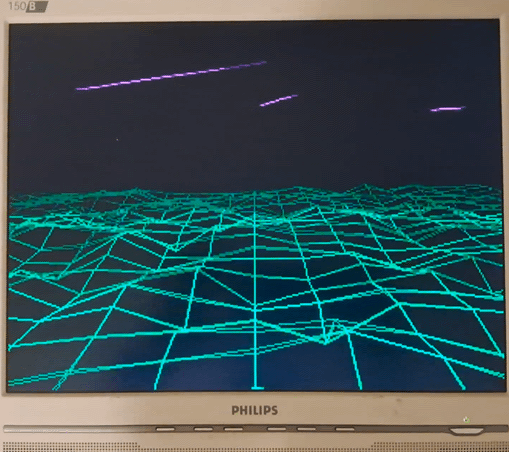

# ESP32 Terrain Animation

Procedural VGA animation for LILYGO® TTGO VGA VGA32 Module V1.4 ESP32 using FabGL:
- Green wireframe terrain flyover
- Depth-based terrain shading
- Multiple purple sky shots (up to 5 active)
- Double-buffered rendering when memory allows

